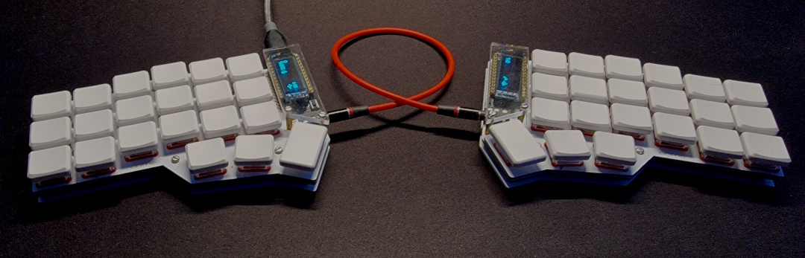
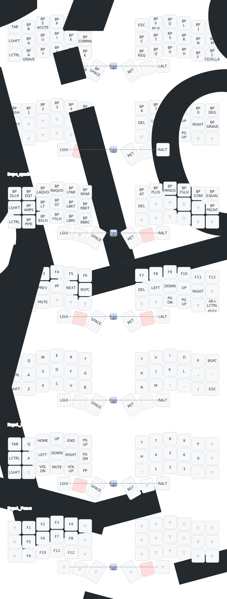

# ZMK Config

ZMK firmware configuration for Corne chocolate keyboards, optimized for
English/French/Programming.



## Features

- [Bépo](https://bepo.fr/wiki/Accueil) and [Ergo-L](https://ergol.org) layouts

## Keymap



## Local Build

```console
west build -p -d build/left -b nice_nano_v2 -S studio-rpc-usb-uart -- \
-DSHIELD=corne_left \
-DZMK_CONFIG="zmk-config/config" \
-DCONFIG_ZMK_STUDIO=y

west build -p -d build/right -b nice_nano_v2 -S studio-rpc-usb-uart -- \
-DSHIELD=corne_right \
-DZMK_CONFIG="zmk-config/config" \
-DCONFIG_ZMK_STUDIO=y
```

## References

- [Corne Keyboard](https://github.com/foostan/crkbd)
